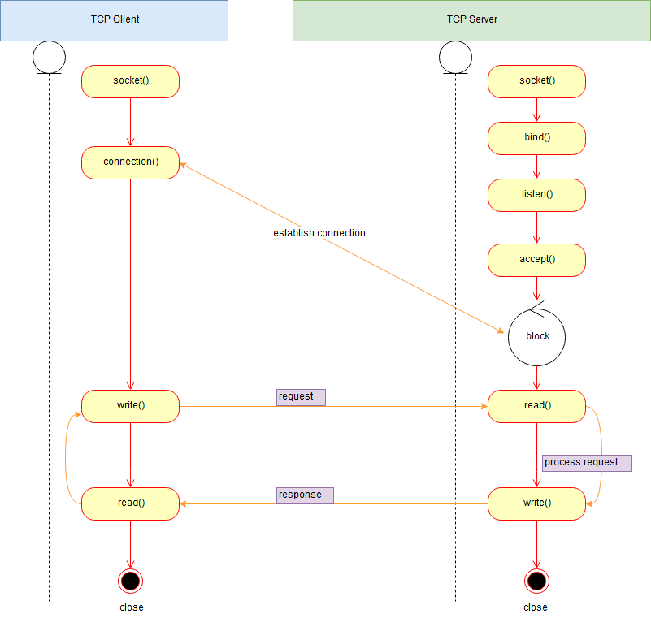

# "HI" socket server

[](https://travis-ci.org/nightlegend/hi) [](https://codecov.io/gh/nightlegend/hi)

"HI" written in Go (Golang). If you need a socket server, you will love "HI".

## socket process


## Start using it

```sh
$ git clone https://github.com/nightlegend/hi.git
```


### Use a vendor tool like [Govendor](https://github.com/kardianos/govendor)

1. `go get` govendor

```sh
$ go get github.com/kardianos/govendor
```
2. Create your project folder and `cd` inside

```sh
$ mkdir -p $GOPATH/src/github.com/myusername/project && cd "$_"
```

3. Vendor init your project and add gin

```sh
$ govendor init
$ govendor add +external
$ govendor install +local
```

4. Start redis server

[redis](https://redis.io/)

5. Configure your redis server connection.

```go
func NewCli() (*redis.Client, error) {
	client := redis.NewClient(&redis.Options{
		Addr:     "localhost:6379",
		Password: "", // no password set
		DB:       0,  // use default DB
	})
	err := client.Ping().Err()
	return client, err
}
```

5. Run your project

```sh
$ go run server.go
```